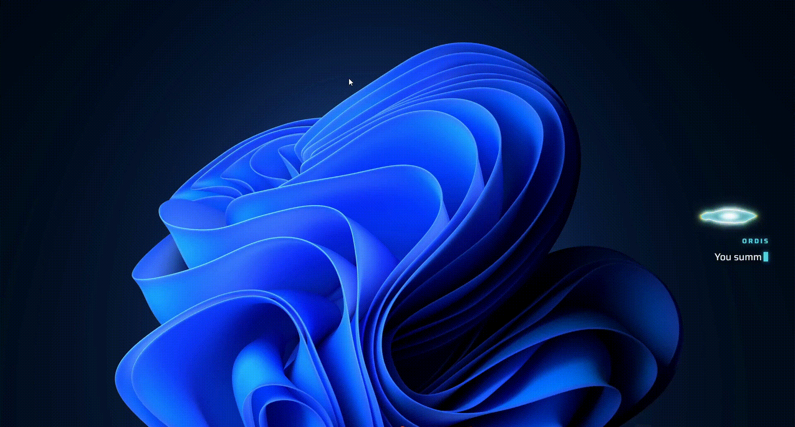

# SHARD

This is my hobby project. I got inspired by Ordis from Warframe and wanted
something like him living on my own PC, a little companion that sits in the
tray, notices what's going on with your machine, and pops up now and then to
say something about it. Nothing serious.



It reacts to stuff like games/apps opening and closing, your PC running hot or
low on space, locking/unlocking, waking up from sleep, the time of day, a
download finishing, etc. It also knows when to shut up: quiet
hours, fullscreen games, and while you're on a call, it won't interrupt.

## Download

Grab the latest build from the [Releases page](https://github.com/Shroud-y/codex/releases), 
download the setup `.exe` and run it. It installs, starts with Windows, and
lives in your tray from then on. Closing its windows doesn't quit it,  right-click
the tray icon and hit **Quit** if you actually want it gone.

## Build it yourself

Want to build it from source instead? You'll need [Node.js](https://nodejs.org)
and [pnpm](https://pnpm.io).

```sh
git clone https://github.com/Shroud-y/codex.git
cd codex
pnpm install
pnpm build
```

That spits out an installer under `release/`. If you just want to run it
without packaging anything:

```sh
pnpm dev
```

## Customizing the character

You're not stuck with just standart presets. Open the tray icon → **Settings…** → **Presets**.

- **Add a new preset** with the button at the bottom — gives you a fresh
  character you can rename and switch to anytime (the radio button next to it
  picks which one is currently active).
- Each preset lets you drop in your own files, no code or restart needed:
  - **Phrase bank (.json)** — your own lines. Easiest way to start is copying
    [`resources/phrases/bank.json`](resources/phrases/bank.json) and editing
    the text — you only need to include the groups you actually want to
    change.
  - **Appear / disappear sound** — swap the little cue sounds it makes when it
    shows up or leaves.
  - **Appearance video (.webm/.mp4)** — replace how it looks. Use a video, not
    a GIF — GIFs actually stutter here since the browser engine has to decode
    them frame by frame instead of just playing them.
- Hit **Reset to default** on any of those to go back to stock.

Presets you build live under `%APPDATA%\codex\presets\<presetId>\`, so they
survive updates and reinstalls.
